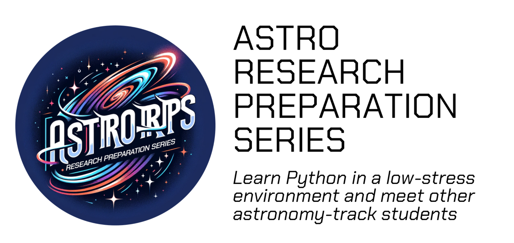

This workshop series will focus on an introduction to the Python programming language in the context of physics and astrophysics applications. All research carried in these scientific fields requires the use of extensive programming, making it a bedrock skill of any scientist. In this seminar, we will start from square one, covering how to install and navigate the programming ecosystem such as the terminal/shell, before moving into how to create scientific programs in python to carry out calculations one might use in a research project. This workshop series is primarily intended for students with little to no exposure to coding or astronomy research. After taking this series, students should be prepared to tackle programming-based courses (e.g., ASTR 255/330) as well as feel comfortable applying to summer research positions. 

This series meets twice a week in the afternoon (M/W 5-6). Monday sessions will have (interactive) lectures in which a new programming concept is introduced. Wednesday is a “lab” in which students will work on a weekly assignment targeting those concepts. We expect most students to finish the weekly assignment during the Wednesday session, but they are due the following Tuesday, so time can be taken outside of the seminar if needed. 

If you are interested in participating in the workshop series, please fill out [THIS INTEREST FORM](https://docs.google.com/forms/d/e/1FAIpQLSd5Kjj2lQ1-8akgA2wnE0ozxFur9A3FQNpgcKvR3k27POCGPg/viewform?usp=sf_link)!

## Topic List

1. **UNIX, Filesystems, Environments and the Python Ecosystem**
  - In this module we will familiarize students with the command line interface of computer operating systems, teach common unix commands, and discuss the installation of environments with Python, and where that is situated in the broader coding ecosystem.
  - Discussion of the differences between CS and DS/astronomy analysis
2. **Pure Python Programming, Calculations, Variables, Datatypes and Scripts**
  - In this module, we introduce the basic python syntax, including variable declaration, basic mathematical operations, and the built-in datatypes (+numpy). We will transition from the iPython interpreter to standalone python scripts.3/
3. **Control flow, Loops, Program Logic, and an introduction to Libraries (astropy+matplotlib)**
  - In this module we will first expand the set of applications by discussing package imports (beyond numpy), including matplotlib and astropy. We will then use relevant examples from these packages to teach program logic and control flow (if/else, try/except) and looping (for/while). 
  - We will also take time here to discuss the parsing of error messages and how to debug errors in code. 
4. **Functions and Functional Programming, Notebooks**
  - Using examples from astropy+matplotlib+numpy, we will introduce the creation of user-defined functions in Python, their benefits, and best practices for documentation, including type annotations. 
  - At this point, we will introduce the concept of jupyter notebooks, how they differ from standard scripts, and common pitfalls. We will provide a framework for development in notebooks by which functions are created and tested and then moved to a python module for import and use. 
5. **Vectorization, Program Efficiency, and Final Project Introductions**
  - In this module we will discuss common programming pitfalls that lead to inefficient (slow) code, and we will formally introduce several methods to write code that will run as quickly as possible. 
  - We will also introduce the final projects and get students thinking about ideas. 
6. **Working with Astrophysical Datasets (Loading, Analyzing, Fitting, Visualizing)**
  - In this module, we will discuss several different libraries (including pandas) in the context of loading and working with more complex astronomical data (beyond individual fits images or simple two column tables) and different file types (csv, fits, hdf5, json). Additionally, retrieving data from online servers and catalogs (e.g., astroquery and sql).   
  - We will discuss real statistical analyses one would apply to these data, and demonstrate several ways of carrying out model fits (e.g., with polyfit, spline fits, chi^2 grid searches, or mcmc). 
  - Finally, we will touch on more advanced plotting techniques for “publication” plots and figures which capture rich datasets. 

Spring Break (end of regular seminar content/assignments)

7. **Introduction to Object Oriented Programming**
  - We return to introductory discussions of objects in python and the OOP paradigm of creating objects with methods and attributes. We will show how to create simple classes that may be useful to students. 
Note there is no explicit lab for this; students are working on their final projects in class.
8. **Introduction to Github and Version Control + Bonus Content**
  - We will introduce the students to the basic use of github for version control. This will in turn prepare them to upload their final projects to github. 
  - We have several “Bonus Content” Topics that we will allow the students to choose from during these last few weeks while the focus is on their final projects. There are no “regular” assignments for these weeks. Topics include:
    - HTML/CSS and building a personal website 
    - LaTeX typesettings (for papers or homework) 
    - More OOP discussion 
9. **Final Project Presentations**
  - Finally, we invite the students to present their final project demonstrations to the class. These projects represent several weeks of coding effort. Students are encouraged to choose any topic that interests them; we have had projects spanning the range from implementing a game like chess or battleship, to astronomy themed projects such as writing a simple integrator or simulating galaxy collisions. We will (potentially) be inviting the department at large to attend these presentations. 

